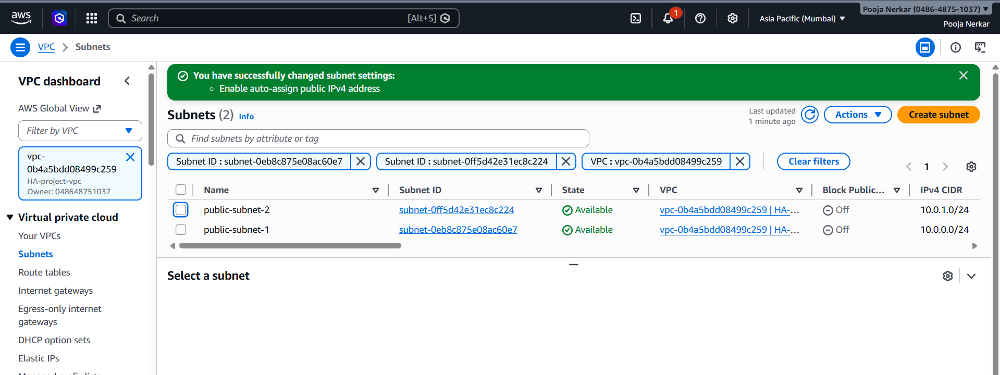
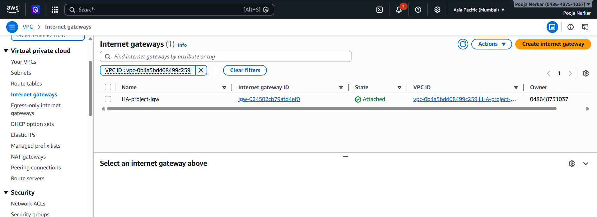
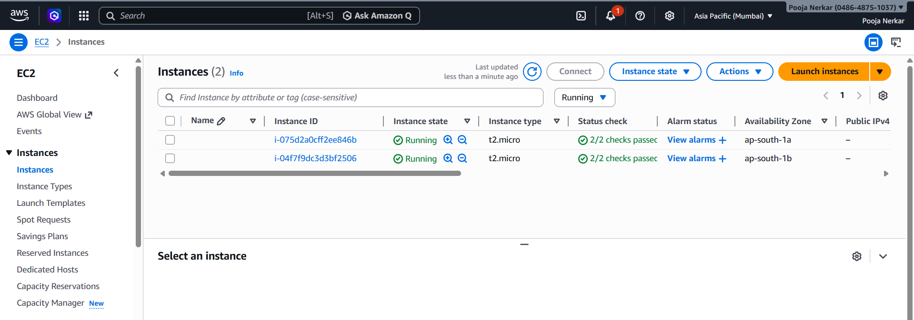
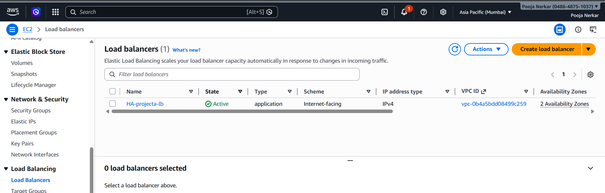
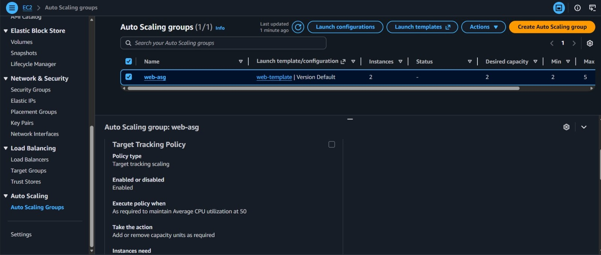
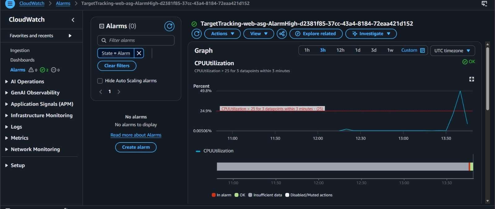
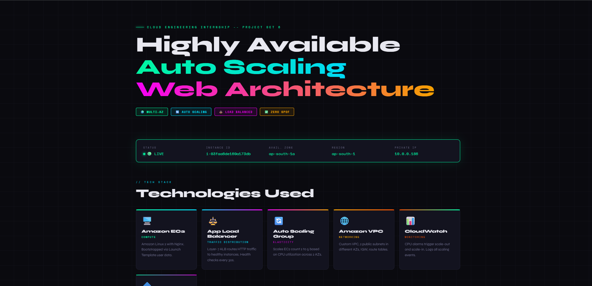
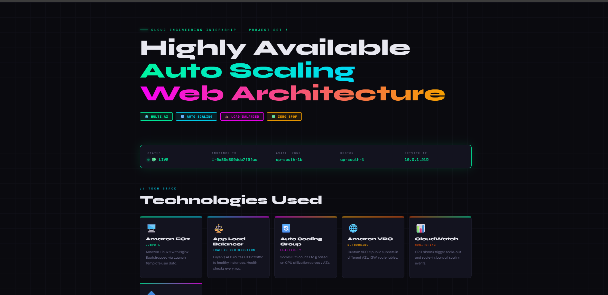

# 🚀 Highly Available Auto Scaling Web Architecture on AWS

  
  
  
  
  

---

## 📌 Overview

This project demonstrates a **Highly Available, Fault-Tolerant, and Scalable Web Architecture** on AWS.

It uses **Auto Scaling + Load Balancer + Multi-AZ deployment** to ensure:
- Zero downtime
- Automatic recovery
- Traffic distribution
- Dynamic scaling based on CPU usage

---

## 🏗️ Architecture

> 📌 Add your architecture diagram here

---

## ⚙️ Tech Stack

| Service | Purpose |
|--------|--------|
| EC2 | Web server (Nginx) |
| ALB | Distributes traffic |
| ASG | Auto scaling |
| VPC | Network isolation |
| CloudWatch | Monitoring |
| Nginx | Web server |

---

# 🚀 Step-by-Step Implementation

---

## 🧩 Step 1: Create VPC

📸 Screenshot:

---

## 🌐 Step 2: Create Subnets

📸 Screenshot:

---

## 🌍 Step 3: Attach Internet Gateway

📸 Screenshot:

---

## 🛣️ Step 4: Configure Route Table

📸 Screenshot:

---

## 💻 Step 5: EC2 Instances Running

📸 Screenshot:

---

## ⚙️ Step 6: Create Launch Template

📸 Screenshot:

---

## 🎯 Step 7: Create Target Group

📸 Screenshot:

---

## 🌍 Step 8: Create Application Load Balancer

📸 Screenshot:

---

## 🔁 Step 9: Create Auto Scaling Group

📸 Screenshot:

---

## 📊 Step 10: Configure CloudWatch Alarm

📸 Screenshot:

---

## 🌐 Step 11: Verify Load Balancing Output

### 🔹 Instance (AZ-1)

### 🔹 Instance (AZ-2)

---

# 💻 User Data Script

This project uses a **user-data script** to automate instance setup.

### 🔧 Features:
- Installs Nginx
- Starts & enables service
- Fetches metadata using IMDSv2
- Generates dynamic HTML page

---

# 🎯 Key Features

- ✅ High Availability (Multi-AZ)
- ✅ Auto Scaling based on CPU utilization
- ✅ Load Balanced traffic distribution
- ✅ Self-healing infrastructure
- ✅ Dynamic instance-level visualization

---

# 📈 Real-World Use Case

- Production web applications  
- SaaS platforms  
- Scalable backend systems  

---

# 📌 Conclusion

This project demonstrates a **production-grade AWS architecture** with:

- Scalability  
- Fault tolerance  
- High availability  
- Automation  

---

# 👨‍💻 Author

**Pooja Nerkar**

---

# ⭐ If you like this project

Give it a ⭐ on GitHub!