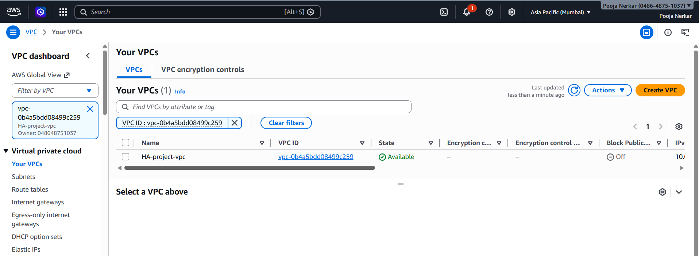
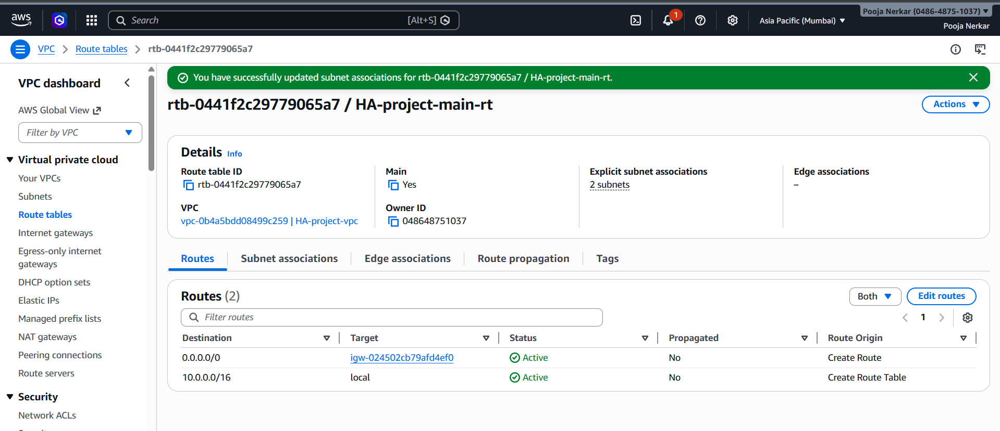
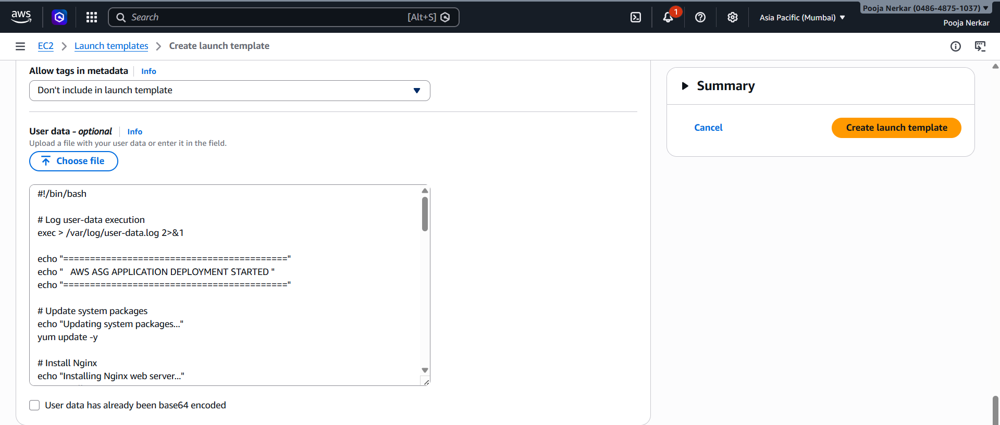
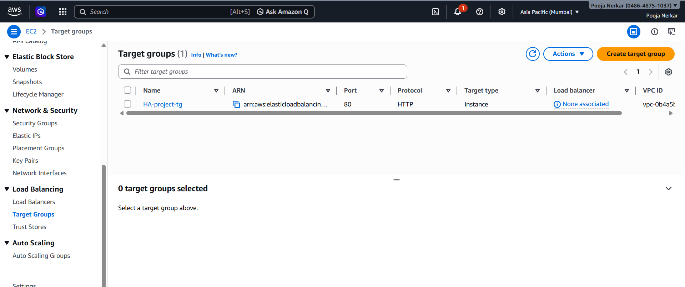

# 🚀 Highly Available Auto Scaling Web Architecture on AWS

  
  
  
  
  

---

## 📌 Overview

This project demonstrates a **Highly Available, Fault-Tolerant, and Scalable Web Architecture** on AWS.

It uses **Auto Scaling + Load Balancer + Multi-AZ deployment** to ensure:
- Zero downtime
- Automatic recovery
- Traffic distribution
- Dynamic scaling based on CPU usage

---

## 🏗️ Architecture

> 📌 Add your architecture diagram here

---

## ⚙️ Tech Stack

| Service | Purpose |
|--------|--------|
| EC2 | Web server (Nginx) |
| ALB | Distributes traffic |
| ASG | Auto scaling |
| VPC | Network isolation |
| CloudWatch | Monitoring |
| Nginx | Web server |

---

# 🚀 Step-by-Step Implementation

---

## 🧩 Step 1: Create VPC

- Created custom VPC
- Enabled DNS support

📸 Screenshot:

---

## 🌐 Step 2: Create Subnets

- 2 Public Subnets
- Different Availability Zones

📸 Screenshot:

---

## 🌍 Step 3: Attach Internet Gateway

- Enables internet access

📸 Screenshot:

---

## 🛣️ Step 4: Configure Route Table

- Added route:
  - `0.0.0.0/0 → IGW`

📸 Screenshot:

---

## 💻 Step 5: Create Launch Template

- AMI: Amazon Linux
- Instance Type: t2.micro
- Added **User Data Script**

📸 Screenshot:

---

## 🎯 Step 6: Create Target Group

- Protocol: HTTP
- Port: 80
- Health checks enabled

📸 Screenshot:

---

## 🌍 Step 7: Create Application Load Balancer

- Internet-facing
- Listener: HTTP (80)
- Attached Target Group

📸 Screenshot:

---

## 🔁 Step 8: Create Auto Scaling Group

- Min: 2
- Desired: 2
- Max: 5
- Multi-AZ deployment

📸 Screenshot:

---

## 📊 Step 9: Configure CloudWatch Alarm

- Scale Out: CPU > 70%
- Scale In: CPU < 30%

📸 Screenshot:

---

## 🌐 Step 10: Verify Output

- Access ALB DNS
- Refresh multiple times
- Observe different instances (Load Balancing)

### 🔹 Instance 1

### 🔹 Instance 2

---

# 💻 User Data Script

This project uses a **user-data script** to automate instance setup:

### 🔧 Features:
- Installs Nginx
- Starts & enables service
- Fetches metadata using IMDSv2
- Generates dynamic HTML page

### 📌 Output shows:
- Instance ID
- Availability Zone
- Region
- Private IP

---

# 🎯 Key Features

- ✅ High Availability (Multi-AZ)
- ✅ Auto Scaling based on CPU
- ✅ Load Balanced traffic
- ✅ Self-healing infrastructure
- ✅ Dynamic instance visualization

---

# 📈 Real-World Use Case

This architecture is similar to:
- Production web apps
- SaaS platforms
- Scalable backend services

---

# 📌 Conclusion

This project demonstrates a **production-ready AWS architecture** with:

- Scalability
- Reliability
- Automation
- Fault tolerance

---

# 👨‍💻 Author

**Your Name**

---

# ⭐ If you like this project

Give it a ⭐ on GitHub!